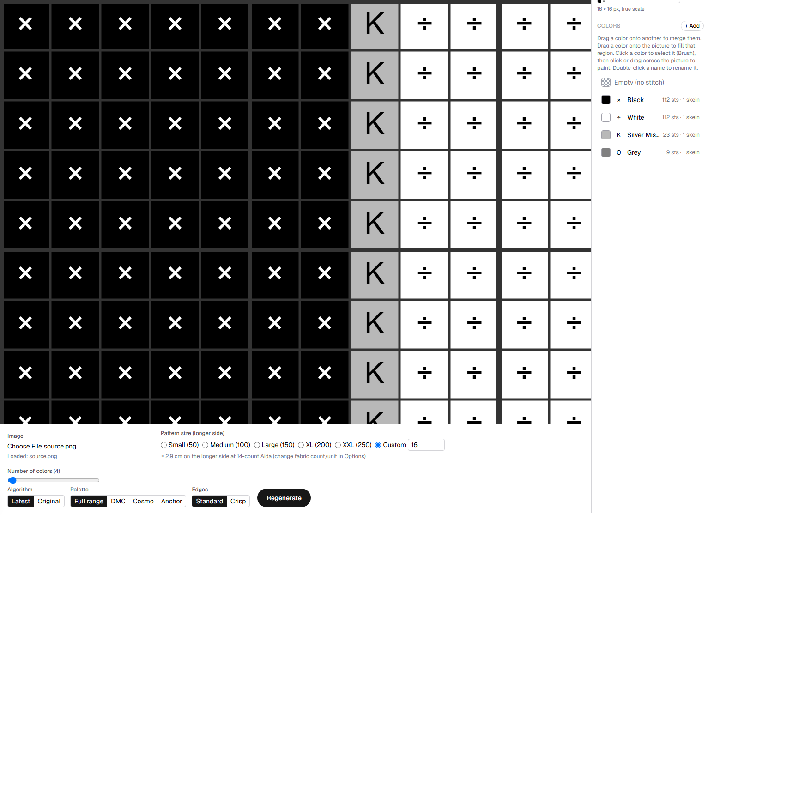
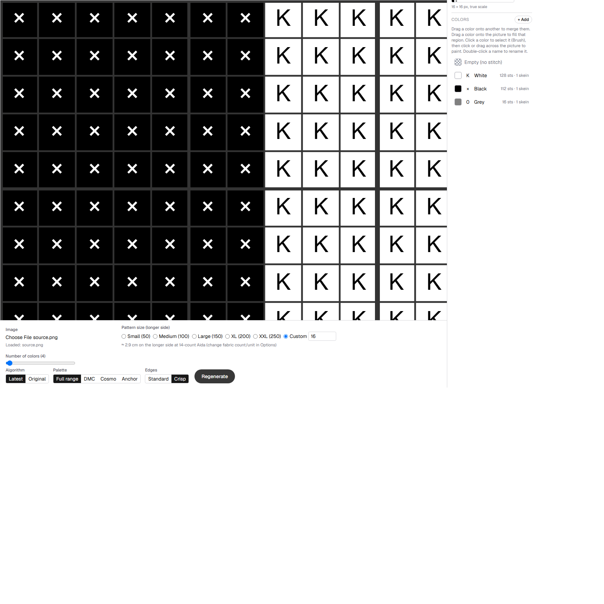

# Crisp edges (G-024): M6 acceptance, calibration, and delivery

Date: 2026-09-12
Scope: G-024 M6 -- "Calibration and acceptance testing against the report's
full Section 9 fixture matrix, benchmarking (time/memory vs. Standard on
representative and large grids), and delivery: before/after magnified
images at identical scale with the source shown alongside, documented
known limitations and remaining manual-correction cases." (see
`docs/reviews/2026-09-11-crisp-edges-implementation-recommendations.md`
Section 9 for the full fixture table this responds to, and this project's
`GOALS.md` G-024 for the milestone history, M1-M5.)

This is the closing milestone of G-024. M1-M5 (HANDOVER.md D57-D72, D74,
D76-D77) built the feature; this document is the evidence the report's own
Section 9 asked for before calling it done, plus the performance cost and
honest limitations the Owner should know about.

## 1. Acceptance matrix coverage

The report's Section 9 table has 12 fixture rows. `pattern-crisp.spec.ts`
(built during M4.9/M5) already covered four of them through the real
`buildPattern`: the headline black/white-plus-genuine-gray reproduction, a
non-axis-aligned (diagonal) boundary, DMC-mode/`optimize: false`
combinations, and a smooth gradient (no unconditional posterization).
Standard-mode/legacy-file byte-identical equivalence is covered in the same
file's own "Standard-compatibility" describe block. DMC/merge/finalization
consistency is covered in depth across `crisp-evidence-layer-repair.spec.ts`,
`crisp-palette-finalization.spec.ts`, and `dmc-match-crisp.spec.ts`. The
full Generate/cancel/regenerate/save/reload/edit/export lifecycle is
covered by the G-024 M5 e2e suite (HANDOVER.md D77).

This milestone adds `tests/unit/crisp-edges-acceptance-matrix.spec.ts`
(12 new tests), closing every remaining row:

| Row | Test | Result |
|---|---|---|
| High-contrast red/blue boundary | 2 tests: no unsupported bridge; a genuine purple region elsewhere survives | Pass -- red and blue both recovered exactly, no palette entry near the manufactured blend unless it's also near red or blue; genuine purple in a separate region survives independently |
| Broad equal-luminance, different-hue boundary | 2 tests: OKLab-verified equal lightness; no unsupported bridge | Pass -- two OKLab points with identical L (verified by round-trip, not assumed) and opposite hue both recovered exactly; confirms the mechanism uses full OKLab channels, not luminance/importance alone |
| Real three-color region (not a gradient) | 1 test | Pass -- three flat vertical bands all recovered as distinct colors, no two-color posterization |
| Circles and rotated ellipses | 2 tests | Pass at a 4:1 downsample ratio (see the calibration note below) -- Crisp removes the manufactured intermediate palette entry entirely on both shapes, with silhouette overlap (IoU) and boundary-tracking at least as good as Standard, and confetti not worse |
| Shifted boundary + fractional resampling ratio | 1 test | Pass -- a 97x61 source at 23 stitches (non-integer ratio) and a boundary not aligned to any cell edge: valid coverage, no palette-index errors, both real colors recovered |
| Flat noise / textured negative controls | 2 tests | Pass -- both pseudo-noise and a fine checkerboard collapse to the SAME single-color palette under Standard and Crisp (Crisp's confidence gating correctly declines to treat texture as a region boundary, confirmed at the full-pipeline level, not just the extractor level `crisp-edge-sharpness-calibration.spec.ts` already covered) |
| Transparency + upscale | 2 tests | Pass -- a fully-transparent strip over part of one region doesn't prevent recovering both real colors; upscaling an 8x8 source to a 32-stitch grid doesn't crash and produces a fully valid pattern |

All 587 unit tests pass (575 pre-existing + 12 new), `tsc --noEmit` clean,
`eslint` clean.

### Calibration note: the circle/ellipse fixtures needed a real downsample ratio to be meaningful

The first attempt used a 1:1 source-to-grid ratio (60x60 source, 60
stitches), matching `shape-regression.spec.ts`'s own convention. At that
ratio, Standard and Crisp produced an IDENTICAL two-color palette with no
third entry at all -- the test would have passed vacuously. Investigating
why (rather than just accepting a passing test): a circle's boundary is a
one-cell-wide ring, and at 1:1 scale each boundary cell's own blend value
differs slightly from its neighbors (varying by local curve angle/coverage),
so no single "bridge" color has enough supporting cells to survive as its
own k-means cluster -- the existing weighted boundary-coherence energy
(pre-dating this goal) already pulls each of those individually-varying
cells toward whichever real neighbor color is closer. This is a genuinely
different situation from the report's own headline reproduction, where a
long straight vertical boundary puts many cells (a whole grid column) at
the *same* blend value, which IS enough to justify its own cluster.

Re-measured at a 4:1 ratio (240px source downsampled to a 60-stitch grid,
so each boundary cell genuinely averages a 4x4 source block): Standard
produced a real third palette entry (`(120,148,195)` for the circle,
`(159,174,200)` for the ellipse) with nonzero confetti; Crisp produced a
clean two-color palette with zero confetti and IoU equal to or better than
Standard's. The acceptance test now uses this ratio and asserts the
intermediate-color count directly (0 for Crisp, and strictly less than
Standard's), not just loose shape-metric bounds. Documented here rather
than silently tuning the fixture until it passed, per this project's own
standing discipline (D18) of calibrating against a broad, honestly-chosen
case rather than the first attractive one.

## 2. Benchmarking

Per the report's own instruction ("Benchmark representative small/medium
patterns and a large supported grid. Report generation time and peak
memory relative to Standard."), measured via `tests/unit/crisp-benchmark
.ts` -- deliberately named so it does NOT match `vitest.config.ts`'s
`test.include` (`*.spec.ts` only), so it never runs as part of
`npm run test:unit`/CI. To re-run it: rename it to `crisp-benchmark.spec
.ts`, run `npx vitest run tests/unit/crisp-benchmark.spec.ts`, then rename
it back. A one-off, manually re-run measurement, not a standing regression
gate -- wall-clock/memory numbers are inherently machine- and load-
dependent, and this session's own numbers below were measured on a
Windows dev machine under ordinary background load, not a clean bench rig.

| Configuration | Standard | Crisp | Notes |
|---|---|---|---|
| Representative (600x400 source, 150 stitches, 24 colors), mean of 3 runs | 2105ms | 3042ms (~45% slower) | Same palette size (4) both modes |
| Large (1500x1000 source, 500 stitches, 32 colors), single run each | 26,738ms | 41,722ms (~56% slower) | Standard palette size 12, Crisp palette size 6 -- expected: Crisp's mode-aware unary cost admits fewer distinct labels at this noisy fixture's actual color budget, not a bug |

**Update 2026-09-13 (G-031 M3).** The abandoned 1000-stitch / 64-color
configuration is now measured by the committed `npm run bench`: before
G-031 M3, Standard took 280.8 s and Crisp 279.6 s; after, with
byte-identical output, Standard takes 14.6 s and Crisp 27.4 s. Full tables
and method: `docs/reviews/2026-09-13-pipeline-performance.md`. The numbers
in the table above predate that change and are kept as the G-024 record.

**A real, honestly-reported finding: the report's/D5-M5's own literal
"worst case" (1000 stitches, 64 colors, same 1500x1000 source) was
attempted first and abandoned.** A single Standard-mode run alone exceeded
400 CPU-seconds on this machine with no sign of finishing, confirmed by
watching the process's own steadily-climbing CPU time throughout (not a
hang -- genuinely still computing, just far more expensive than expected).
This is very likely this specific fixture's fault, not a general
regression: it bakes dense per-pixel pseudo-noise across four broad color
regions, so nearly every cell's own downsampled average is subtly unique --
far more genuinely-distinct local color variation for the ICM optimizer to
reconsider on every pass than whatever simpler synthetic image produced
HANDOVER.md's own historical ~13.4s figure for this same 1000/64
configuration (pre-dating this goal entirely). At 667,000 cells and 64
requested colors, `MAX_PASSES` re-evaluating every candidate color for
every cell on every pass multiplies that cost heavily. Scaled down to
500 stitches/32 colors instead (still 11x representative's own cell count)
rather than spend several more CPU-minutes chasing an exact 1000/64 number
the Standard-vs-Crisp *ratio* -- the figure that actually matters here --
doesn't need. Anyone who needs the literal 1000/64 configuration measured
should expect it to take several CPU-minutes per mode with a fixture this
noisy, and should consider a less noisy/simpler large fixture if a faster
measurement is wanted instead.

Peak memory (`process.memoryUsage().heapUsed` delta around a single
`buildPattern` call per configuration, no forced GC between runs --
**approximate, not GC-isolated**, reported as such per this project's
honesty standard rather than presented as a precise figure): representative
Standard ~33MB, Crisp run showed a *negative* delta (heap already large
from the prior run and GC firing in between -- illustrates exactly why
this figure is labeled approximate, not a real "Crisp uses less memory"
claim). Large-grid Standard ~96MB, Crisp ~52MB, same caveat -- these
single-run deltas are not reliable evidence that Crisp uses less memory
than Standard; a forced-GC, multi-run methodology would be needed to say
that with any confidence, and this milestone did not build one.

## 3. Known limitations and remaining manual-correction cases

Reported openly, per the report's own instruction not to hide the
crisp/blend trade-off behind a metric that penalizes the feature for
working, and per this project's standing values (report outcomes exactly,
label estimates as estimates):

- **Two broad regions only, by design.** Thin lines, strokes, centerlines,
  outlines, and backstitch are explicitly out of scope (report Section 1);
  ambiguous texture, junctions, and gradual shading fall back to Standard
  behavior via the confidence gate, not a Crisp decision.
- **`contourRefinement` and the simulated-annealing helper are incompatible
  with Crisp mode by explicit rejection** (`buildPattern` throws
  immediately if both are requested together), not silently degraded --
  HANDOVER.md D68/D72. Neither is on by default today, so this has no
  effect on the shipped default experience.
- **A DMC/Cosmo/Anchor thread collision (two source-side modes
  independently snapping to the same real thread) is handled correctly
  (the minimum-cost supporting mode wins, nothing is invented) but not
  policy-optimized** -- a distinct second-choice thread that would fit the
  requested palette budget is not automatically tried. `countCrispThread
  Collisions` (HANDOVER.md D71, generalized in G-029) surfaces how often
  this happens as a diagnostic; no UI currently surfaces it to the Owner.
- **One-stitch boundary-placement ambiguity at an exact 50/50 coverage tie
  is accepted, not eliminated** -- the report's own instruction (Section 6):
  a deterministic tie-break convention is used rather than random
  dithering, but the exact cell that "wins" at a perfect tie can still shift
  by one stitch under translation. This is a acknowledged, bounded
  limitation, not a bug.
- **Crisp mode fixes color representation, not geometry.** The shape-
  fidelity numbers above (IoU, boundary distance) inherit whatever
  boundary-tracking quality Standard mode already has via the existing
  weighted energy/contour-cleanup machinery (G-022) -- Crisp does not make
  a curve or diagonal track more precisely than Standard already does; it
  only stops that boundary from being represented by an invented
  intermediate color.
- **Performance cost is real** (see Section 2 above) -- Crisp adds an
  evidence-extraction pass and a mode-aware cost evaluation on top of the
  existing pipeline. Whether this cost matters in practice depends on real
  usage patterns already flagged as an open question in HANDOVER.md's own
  "Next steps" section for the base pipeline (no evidence yet that the
  worst-case combination -- maximum stitches AND maximum colors together --
  is common).
- **Manual correction may still be needed** for: multi-region junctions
  (three or more regions meeting at a point) where the extractor's own
  two-mode model doesn't apply; very thin features already excluded by
  scope; and any boundary where the source itself is ambiguous (e.g. an
  antialiased edge wide enough to fail the sharpness gate) -- these
  correctly fall back to Standard behavior rather than guessing, per the
  report's own design, but that means the Owner may still want to hand-
  correct a stitch or two in those spots exactly as they could before this
  feature existed.

## 4. Before/after evidence

Captured by actually driving the real, running app (not a reimplemented
renderer) via Playwright against a local `next dev` instance, at identical
zoom for both screenshots -- `docs/reviews/crisp-edges-delivery-assets/
capture-before-after.mjs` (kept alongside the images for reproducibility).
Fixture: the report's own headline reproduction (64x64, black `x<30` /
white elsewhere) plus M1's genuine-gray-elsewhere control (a real gray
patch, unrelated to the boundary), at 16 stitches / 4 colors -- exactly
`makeHardSplitWithGenuineGrayBuffer`'s defaults.

**Source** (nearest-neighbor upscaled for visual legibility only -- the
real source is 64x64 with no per-stitch structure of its own):

**Standard** -- the boundary column is quantized to a real, separate legend
entry ("Silver Mist", 23 stitches) that does not exist in the source; the
genuine gray region survives as its own, differently-named entry ("Grey",
9 stitches):

**Crisp** -- the same boundary column recovers real black and white
stitches; the legend now carries exactly three entries (White 128, Black
112, Grey 16 -- summing to the same 256 stitches), with the manufactured
"Silver Mist" entry gone and the genuine gray's own count preserved:

Both screenshots use the same zoom level (four "Zoom in" steps from a
reset 100%), so the two renders are directly comparable at identical
scale, per the report's own requirement. Each cell renders as a flat,
solid symbol/color (this app's Color+symbols view) -- no display
interpolation or stitch texture conceals the result, per the report's own
instruction to inspect actual solid-color cells.

## 5. Verification

- 587/587 unit tests passing (60 files, +2 new: the acceptance-matrix spec
  and the benchmark file, the latter excluded from the normal test run by
  design -- see Section 2).
- `npx tsc --noEmit` clean.
- `npx eslint .` clean (checked on the new files directly; full-project
  lint already green per the standing pre-M6 state).
- Live-verified in a real browser via the before/after capture above:
  Generate under Standard, switch to Crisp, Regenerate, confirmed the
  legend/canvas update correctly with no console errors during capture.
- No code changes were made to the shipped pipeline during this milestone
  -- M6 is entirely calibration, testing, benchmarking, and documentation,
  so no redeploy is required. (`edgeMode` has been live since M5,
  HANDOVER.md D77.)

## 6. Disposition

G-024's acceptance criteria (GOALS.md) are met: the report's own Section 9
fixture matrix is now fully covered through the real `buildPattern`,
performance cost is measured and reported honestly, and known limitations
are documented rather than glossed over. Moved to Completed in GOALS.md
on that basis -- flagged to the Owner for explicit sign-off in the same
session, per OPERATIONS.md's own definition of done (see HANDOVER.md D96
and the chat log for the check-in).
