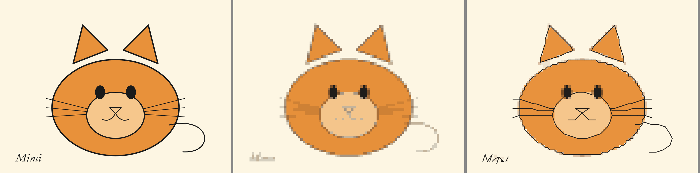
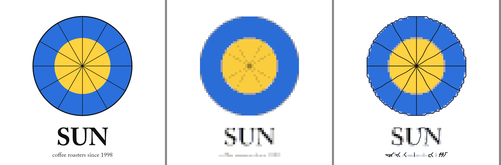
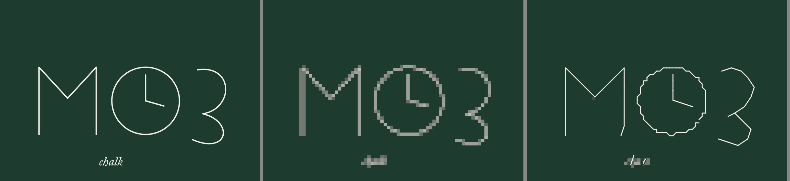
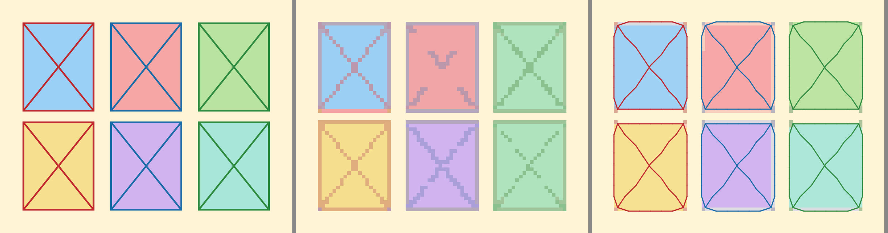
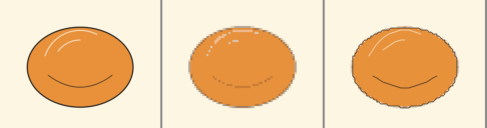

# Backstitch from lines: how the lines are found and what they look like (G-084)

Date: 2026-10-02. Code: `rust/cs-core/src/lines.rs`. The first version (a black top-hat of the luminance, thinned to a skeleton, snapped to
corners by one-cell steps) was replaced the same day after the Owner's review: the lines were wavy, the colours paler than the picture's, and the
search ran on a reduced picture. This document describes the replacement (D272) and what was measured of both.

## What was wrong with the first version

- **Wavy.** A thinned mask is a pixel stair, and snapping it to corners one step at a time turned every stair into a wobble. A straight spoke came out as
  a staircase of unit steps, and a vertical line at a fraction of a stitch came out as a zigzag between two columns.
- **Pale.** The line colour was read from blocks of the reduced picture that were only partly line.
- **Reduced.** Everything ran on a picture reduced until a stitch was 10 pixels, so a one-pixel line was a faint smear.

## Alternatives considered

| Method | Why not |
|---|---|
| Top-hat and thinning (the first version) | The faults above; thinning also leaves spurs and crumbs. |
| Frangi vesselness | The same family as the ridge detector chosen, but gives a strength map without sub-pixel position or direction, so the lines would still have to be thinned. |
| Hough transform, line segment detector | Straight segments only; a curve is a pile of them and the colour of a line is not part of them. |
| Potrace, AutoTrace (centreline) | They trace the outline of a filled shape; a line one pixel wide has two edges, and the centreline mode thins like the first version. |
| Steger's curvilinear line detector, with a lattice fit | Chosen. Sub-pixel centreline, direction and width in one pass; dark, light and coloured lines alike. |

## The method (D272)

1. **Ridges.** Gaussian derivatives of each colour channel at a few scales (up to 0.22 of a stitch) give, at each pixel, the direction across the line, the
   curvature across it and where inside the pixel the line passes. A point is a ridge when the slope along the normal vanishes, the curvature is much
   larger across than along, and the slopes on its two flanks are of opposite sign (which drops the shoulder of an edge). The picture is reduced only so
   far as a stitch of 20 pixels and 3 million pixels call for, against a stitch of 10 pixels before; scales above 2.2 pixels use a picture halved as often
   as needed.
2. **Chains.** Points are linked strongest first along the line's own direction, across gaps of up to 3 pixels, into ordered chains.
3. **Stitches.** A chain is smoothed and then approximated by the stitches, of at most three cells and any slope, between the corners within a cell of it
   that stay within 0.7 cell of it and cost least: one unit per stitch, the squared distance strayed, and the angle turned from the stitch before. A
   dynamic program over the corners and stitches finds the minimum. Chains that meet share a corner, and a stem ends on the nearest corner a longer line
   has used.
4. **Colour and painting out.** The colour of a line is the median over its length of the pixel, at the line or beside it, that differs most from the
   surroundings, read from the original picture. The pixels of a line are painted over from their surroundings.

## Pictures made for the test (synthetic, mine), sensitivity 0.5

| Picture | Stitches | Lines found | Threads for the lines |
|---|---|---|---|
| Cat drawing (outline, whiskers, mouth, tail, lettering) | 100 | 266 stitches, 516 cells | 1 |
| Logo (circle, 12 spokes, bold and small lettering) | 80 | 288, 521 | 1 |
| Chalk: white lines and lettering on a dark board | 80 | 107, 209 | 1, near white |
| Stained glass: red, blue and green outlines on pastel fills | 80 | 264, 850 | 3, the pen colours |
| Black outline and a cream highlight line on orange | 80 | 171, 240 | 2 |
| Pixel art with a one-stitch outline | 64 | 0 | none: a line as wide as a stitch is stitches |

The first picture of each pair below is the source, then the chart without lines, then with them.

The spokes of the logo are now single straight runs of stitches and the boxes of the stained glass are straight, where the first version made staircases and
zigzags. Unit tests pin it: a 30-degree line is 33 to 38 cells of stitches in at most 16 stitches and every corner within 0.75 cell of the line, a circle of
radius 10 has every corner within 0.9 of it, a line of one stitch width in a picture reduced for the search keeps its black, and two lines that meet share a
corner. A circle on a grid of stitches is still faceted (about 25 stitches of up to three cells for a circle of 63), which is what a stitcher would make.

Seen in them: a filled box and its outline can disagree by a stitch at an edge, since the line is placed within 0.7 cell of where it was; corners of a box
are cut a little; small italic lettering becomes fragments, as little as 80 stitches can show of it.

## Time

A 27-megapixel drawing (6000 x 4500) at 150 stitches generates in 4.1 s without the setting and 9.3 s with it, so the lines add about 5 s at that size.
The maps are kept to 3 million pixels, so the memory added is a few hundred megabytes at most for a reduced copy and the derivative maps.

## The gate: telling a drawing from a photograph (D267)

With no gate the first version found 2,235 lines in a textured photograph. What separates a drawing is how much of it is flat: 8 x 8 blocks of the picture
reduced to 512 pixels on its longer side, flat where the standard deviation of luminance is under 6.

| Pictures | Flat share |
|---|---|
| Cat drawing, logo, pixel art (synthetic) | 81 %, 82 %, 94 % |
| A sticker-sheet line drawing on a flat ground | 60 % |
| 29 pictures from the Owner's own folder (photographs, generated images, screenshots; not kept in the repository) | 0 % to 94 %; 20 below 55 %, 9 at or above it |
| Textured photographs among them | 0 % to 26 % |

At 55 % or more the tracing runs; below it, none unless "Also in photographs" is on. The pictures in the middle band (33 % to 53 %) are mixed: a drawing on
a textured ground is refused, the safe error. A second guard refuses more than 25 cells of line per row of stitches.

## Photographs, when asked (D270)

Stricter: the strength needed is higher (80 less 55 times the sensitivity, against 60 less 45 times it for a drawing), a line must be at least 8 stitches
less 3 times the sensitivity long (against 2.5 less the sensitivity), and only the longest strongest lines are kept, up to four cells per row of stitches.
Three of the Owner's own photographs (not kept in the repository), 100 stitches across, with the checkbox on:

| Photograph | Sensitivity 0 | 0.5 | 1 |
|---|---|---|---|
| A bronze statue in a park (fence, trees) | 0 lines | 14 stitches, 36 cells | 102, 280 |
| A photograph of a lake shore | 0 | 16, 49 | 90, 229 |
| A generated pentagram-and-cat image | 55, 167 | 123, 394 | 126, 399 |

In the pentagram picture the rings round the cat come out as smooth arcs in a light thread. In the others a few rails and edges are found at the default and
more at 1. A fence rail one stitch thick or more at 100 stitches is not found.

## Not measured

Scanned drawings with paper noise (the flat-share threshold is untested on them); a light line and a dark line less than a stitch apart (they would be one
line of mixed colour); curved lines at very small sizes; the sensitivity slider barely changes a drawing with strong lines, since every line is above any
threshold, and matters for faint ones.

The test pictures `tests/e2e/fixtures/line-drawing.png` and `line-drawing-light.png` are drawn for this goal with node-canvas: an orange cat head with its
outline and whiskers, and white chalk lines on a green board; no third-party material.
