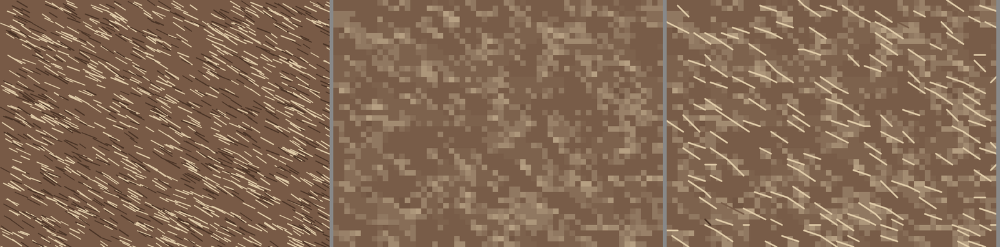

# Texture strokes: how they are found and what they look like (G-085)

Date: 2026-10-02. Code: `rust/cs-core/src/texture.rs`, on the ridge detector and the stitch fit shared with the line tracing
(`ridges.rs`, `stitch_fit.rs`, split out of `lines.rs` for this goal).

## The idea

A hand-stitched owl gets its feathers from short backstitch strokes along them. They are not lines of the picture: they are the streaks inside a textured
area that a stitch, one colour over a whole cell, cannot show. So they are found as the **thin short ridges** of the picture, light or dark, at the
finest scales (Gaussian scales of 1 to 2.2 pixels in a picture reduced to a stitch of at most 20 pixels), by the same Steger detector the line tracing
uses, but with no gate: a smooth area has no ridges and stays free, whatever the subject. The streaks are then:

1. linked into chains (a streak of 0.6 to 6 cells is a stroke; longer is a line or an edge);
2. weighted by how well each lines up with the streaks round it (the length of the mean doubled-angle vector within 3.5 cells, squared, and by
   `n / (n + 3)` so a lone streak counts for little): fur, feathers, hair and grass run one way over an area, the speckle of a splashed background does not;
3. chosen, strongest first, up to a quota per block of 8 x 8 cells (8 times the density, rounded up) and a ceiling of 4,000 strokes, with no two
   in the same cell, so they spread over the picture;
4. fitted to stitches of at most three cells (D272) and given the colour read from the original pixels along the streak, in at most four threads.

The stitches under a stroke stay as the picture gave them (Owner, 2026-10-02: whatever needs the fewest changes). Texture is looked for in the picture
left after the line tracing, so a stroke never lies on a traced line.

## What it looks like

Source, chart without strokes, chart with the default density (a synthetic fur picture drawn for this goal: strokes along 28 degrees, light and dark).
The strokes follow the way the fur runs, and are light where the streaks are light and dark where they are dark.

Three pictures of the Owner's own, 100 stitches across, 14 colours (digital paintings: a fluffy pink cat, a feathered headdress with a portrait, a
dark fantasy cover with fur, bark and hair; not kept in the repository), stitches of strokes at the default density 0.3 and at 1:

| Picture | Strokes at 0.3 | At 1 | Time added at 100 stitches |
|---|---|---|---|
| Fluffy cat | 277 stitches | 693 | about 2 s |
| Feathered headdress | 480 | 813 | about 1 s |
| Dark fantasy cover | 535 | 1,245 | about 1.4 s |

Looked at: on the cat, light strokes stand out of the silhouette like fur tips and dark strokes follow the body; on the headdress they run along the
barbs of the feathers, the hair and the wrinkles; on both there are also strokes on the blotchy background, since a splashed background is texture
too. They read as texture. Whether it is what a stitcher would make is the Owner's judgment.

## Tests

Eight Rust generation tests: off gives the chart it always gave, a furry picture gets strokes that run within 18 degrees of the texture and are light
on a dark ground, a smooth picture gets none at any density, the density raises the count and there is a ceiling, strokes are corner to corner within
three cells in at most four new threads, the same picture gives the same strokes, a brand gives brand threads, and lines and strokes can be asked for
together. Three Playwright tests: strokes come back as backstitch and more with a higher density, a smooth picture gets none, the choice is remembered.

## At volume (criterion 7)

A 3000 x 2250 synthetic fur picture at 250 stitches across gives 5,042 backstitch stitches (4,000 strokes is the ceiling, in chains); at 450 across, 5,733.
Through the real editor and processor, with and without the strokes:

| | Without | With 5,042 stitches |
|---|---|---|
| Generate | 2.1 s | 3.2 s |
| Frame gap while zooming (median / worst) | 16.7 / 167 ms | 16.7 / 217 ms |
| PNG export | 1.4 s | 2.2 s |
| OXS | 0.55 s | 0.87 s |
| Pattern Keeper PDF | 0.78 s | 0.83 s |
| A4 pages (48 pages) | 11.8 s | 14.9 s |

The editor keeps a 16.7 ms median frame, the worst gap grows by about 50 ms, and no export fails.

## Not done, or not known

The result on a real hand-stitched design was not compared; strokes on blotchy backgrounds are not removed; the density slider's scale (8 strokes a block
at full) was set from three pictures and a synthetic one; a stroke is a single colour, so a streak that fades along its length is its mean.
